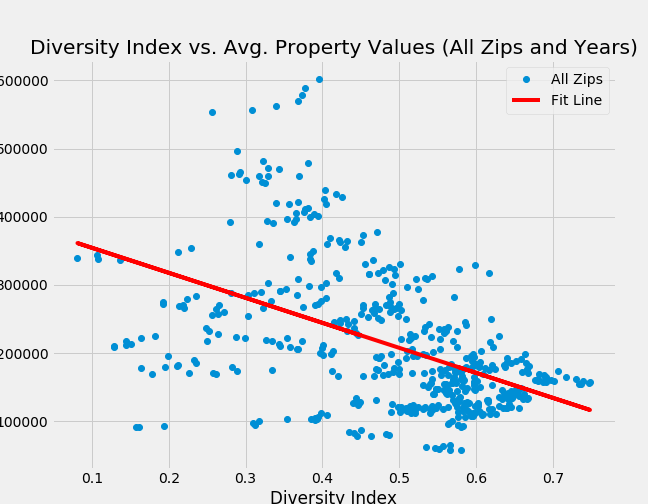
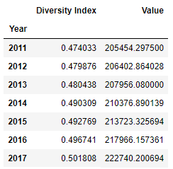
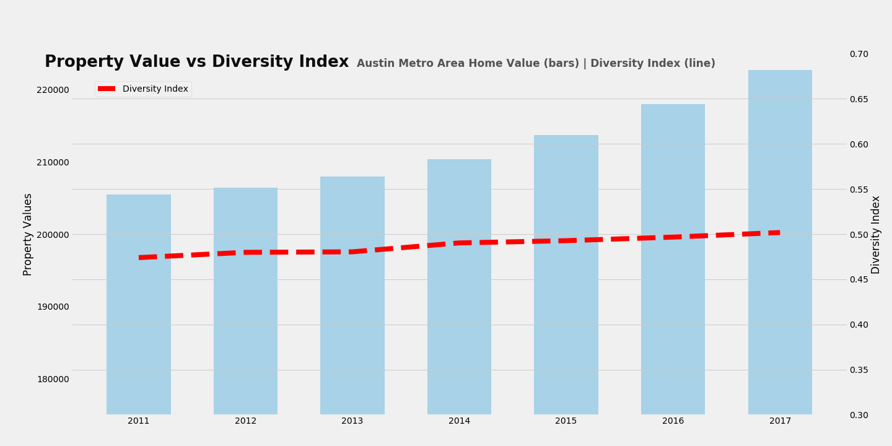
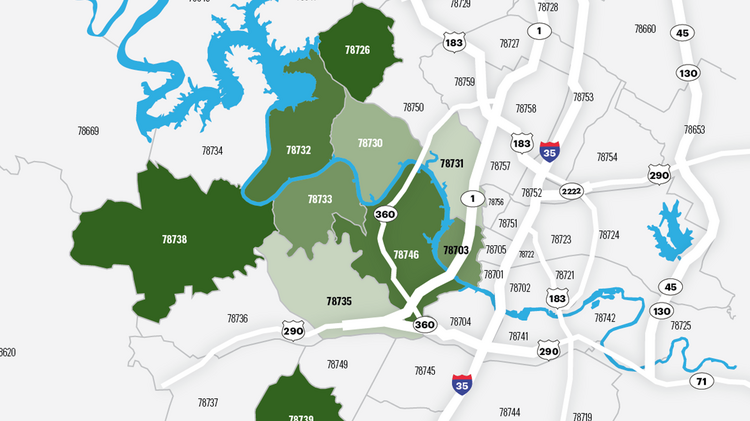
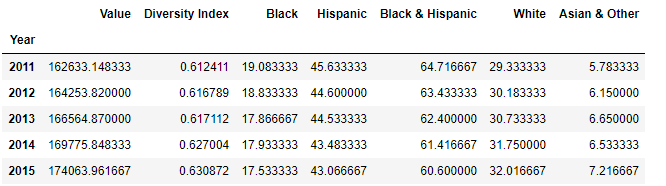
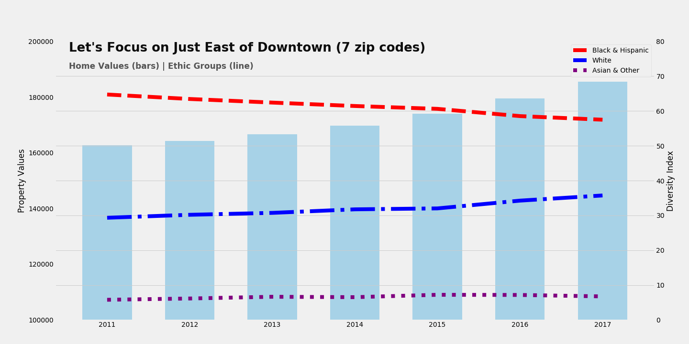
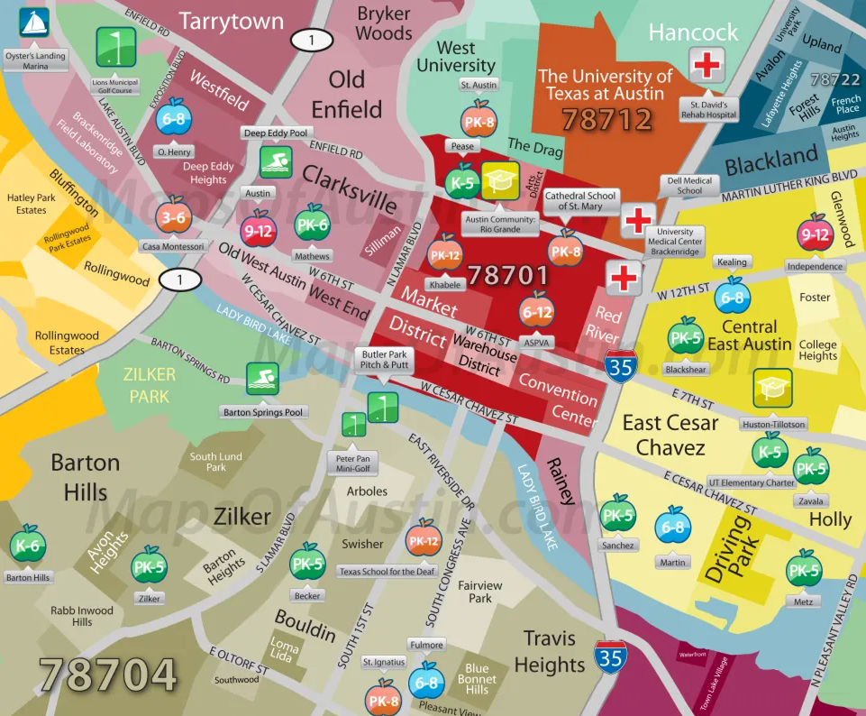
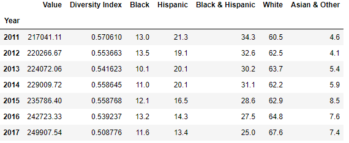
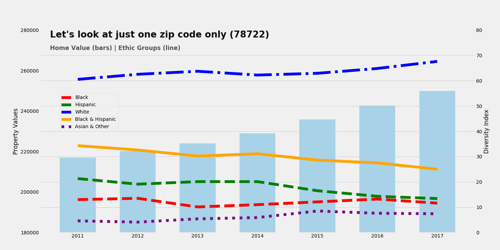

# Property Values and Diversity of Austin

## Our Team:

* Eric Tonian
* Godwin Assiogbon
* Aydin Yildirim
* Trevor Kulbeth
* Agustin Gonzalez
* Wenbin Zhao "Billy"

### Project Description:
This project will examine the relationship between property values and racial demographics in the zip codes areas of Austin, TX from 2011-2017.

### Hypothesis:
##### * H-Null: If property values rise within Austin (by zip code area), then there will be no changes of the diversity index*.
##### * H-Alt: If property values rise within Austin (by zip code area), then the diversity index* will show significant negative changes.

### Research Questions to Answer:
1. Does the diversity negatively impacted by the raise of home value in Austin?
2. What is Austin's geographical layout like in relation to home value and diversity?
3. Is there any specific locations that diversity and home value show strong correlations?
4. (bonus) Is school rating a good predictor of home value?

### Data Sources
* Zillow Home Value Index (ZHVI) for All Homes - Time Series, 1996-2018 (https://www.zillow.com/research/data/)
* U.S. Census American Community Survey (ACS), 2011-2017 (https://factfinder.census.gov/faces/nav/jsf/pages/index.xhtml)
* GreatSchools API (https://www.greatschools.org/api/docs/technical-overview/)

#### How are data described:
1. Diversity Index - The 'Diversity Index' is a value between 0 and 1 which represents the probability of two people being of a different race if randomly picked from the same sample.
2. Period
3. Home Value
4. Zip data (for geo location and map)

### Tools & Techniques:
1. Pandas DataFrame for ETL
2. Matplotlib, Follium, Google Map API for Visualization
3. Python LXML/XML parsing for GreatSchools.org API

### Our Findings
#### 01 - Godwin - Data Merge Process - Scatter Plot

#### 02 - Eric - Regression Analysis

#####  Linear Regression Analysis (All Zips and Years)
slope: -366763.29582571954    intercept: 391067.6471445414    stderr: 29170.424325240187
r-value: -0.48937718437748057    p-value: 1.0384045132848702e-31

##### Linear Regression Analysis (Urban Zips, All Years)
slope: -721519.9070789743    intercept: 604243.1975286676    stderr: 55372.521800578215
r-value: -0.8099936377599409    p-value: 2.4371772271053096e-22

#### 03 - Aydin - Google Heat Map

#### 04 - Trevor - Zip Code Color Map

#### 05 - Agustin and Billy - General Trend vs Specific Areas
Let's take a look at the data. 
Austin as a whole (including all zip code) shows a slightly uptick of diversity index:

The graph confirms that:

What if we look closer - just the area that immediately east of downtown by I-35?
I included 7 zip codes. Here is the map showing the zip codes selected:

Now, let's take a look at the data set:

Interesting, isn't it? These area shown quite a bit of movement among different ethic groups:

Now, let's look further in granuality. Just one zip code: 78722
What about 78722?

Let's take a look at the data first: \

The graph and T test will show much more distinctive pattern than Austin in gernal:\

##### Regression Analysis:
LinregressResult(slope=-3720.172417840378, intercept=342491.2738648559, rvalue=-0.9688170714695908, pvalue=0.0003243039756793674, stderr=425.4978954053012)

#### 06 - Agustin and Billy - School Ratings and Home Values

### Conclusion

### Questions?
